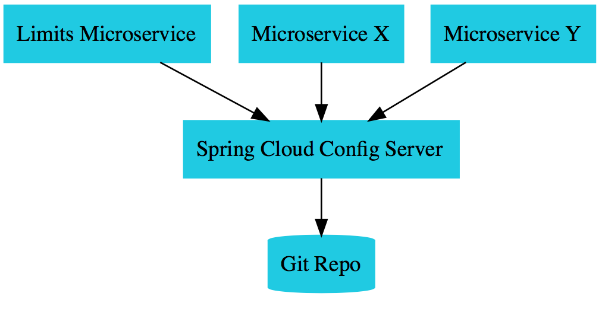

# scc-spring-cloud-config-demo
This repository uses git subtree to centralize multiple microservices projects using Spring Cloud Framework to solve the Challenges of Microservices Achitecture.

## What the Challenges of Microservices Architecture approached here ?

* ### Configuration Management
    Due to the large number of microservices how to manage multiple configurations from different environments ?

## Projects
* [scc-config-server](scc-config-server) -> Spring Cloud Config Server
* [scc-limits-service](scc-config-server) -> microservice
* [scc-local-config-repo](scc-config-server) -> repository of configuration files.

## Git Subtree commands
How to use Git subtree ?

1 - Add your remote repository
`git remote add -f scc-config-server https://github.com/aurelios/scc-config-server.git`

2 - To Create the subtree project

`git subtree add --prefix scc-config-server scc-config-server main --squash`

3 - To pull the commits from the main project

`git subtree pull --prefix scc-config-server scc-config-server main --squash`

4 - To push the commits of the subtree into the main project

`git subtree push --prefix scc-config-server scc-config-server main`

